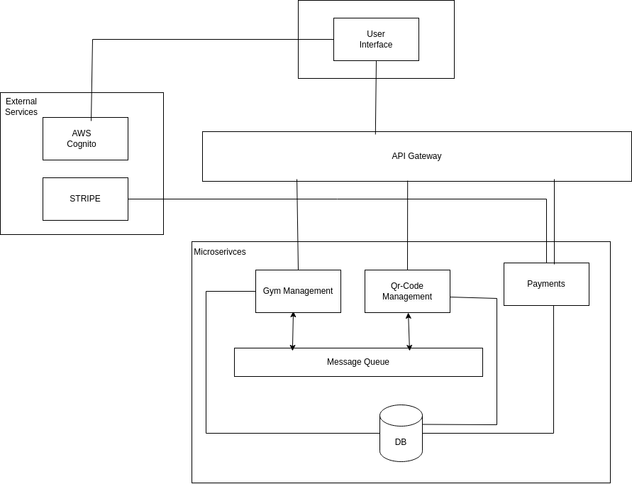

# Architecture

## Microservices Architecture

This diagram illustrates the architecture of our microservices, external services, and an API gateway. Below is a breakdown of the components:

### External Services
- **AWS Cognito**: Used for user authentication and identity management.
- **Stripe**: Integrated for handling gym membership payments.

### User Interface
- The front-end application where users interact with the system.
- Communicates with the backend through the API Gateway.

### Microservices
1. **Gym Management**:
   - Handles functionalities related to gym operations and management.
2. **QR-Code Management**:
   - Manages QR code-related operations, such as generating and scanning qr-codes.
3. **Payments**:
   - Manages payment-related tasks and communicates with Stripe for processing transactions.

### Message Queue
- Microservices communicate asynchronously through a shared **Message Queue**. In our case, we utilized Kafka to facilitate communication between the Gym Management and QR-Code Management microservices.

### Database (DB)
- We utilized a single MySQL database to store all the essential data for our application. This centralized database serves as the primary repository for user information, QR code details, payments information and other related resources, ensuring consistency and easy management across different microservices.

## Deploy Architecture

