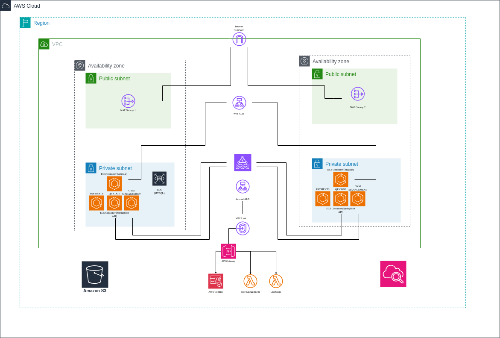
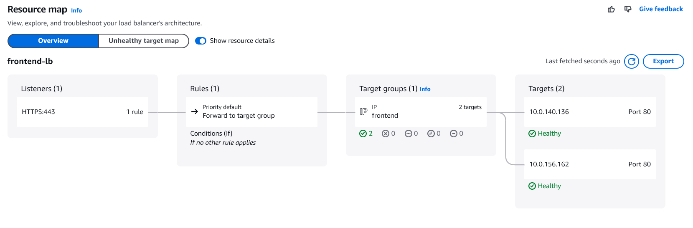
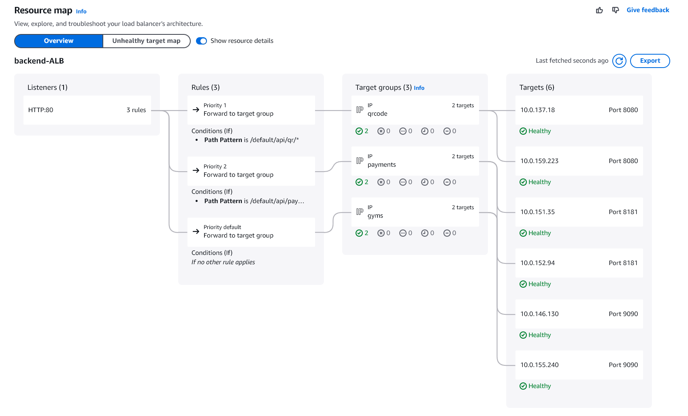
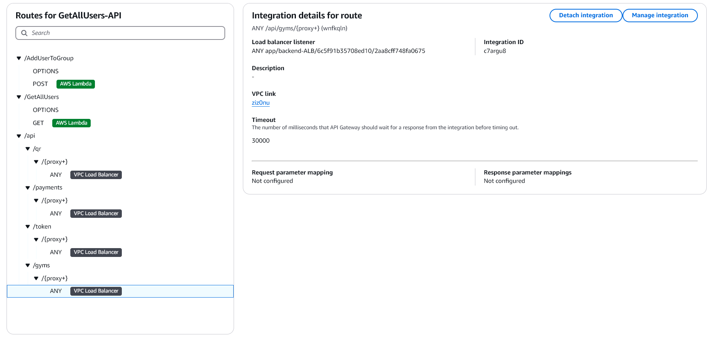
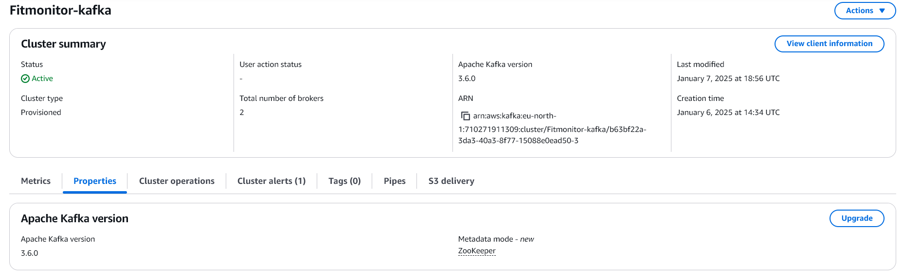

# Architecture

## Microservices Architecture

This diagram illustrates the architecture of our microservices, external services, and an API gateway. Below is a detailed breakdown of its components:

## External Services

- **AWS Cognito**: Used for user authentication and identity management, ensuring secure access to the platform.
- **Stripe**: Integrated to manage gym membership payments seamlessly.

## User Interface

- The **frontend application** is where users interact with the system.
- It communicates with the backend through the **API Gateway**, which acts as the intermediary between the user interface and microservices.

## Microservices

1. **Gym Management**:
Manages functionalities related to gym operations, including membership management and gym attendance tracking.

2. **QR-Code Management**:
Handles QR code operations such as generating unique codes for users and scanning them for authentication or tracking purposes.

3. **Payments**:
Processes payment-related tasks and interacts with Stripe for secure transaction handling.

## Message Queue

- Microservices communicate asynchronously using a shared **Message Queue**.
- **Apache Kafka** is used to facilitate reliable communication, ensuring that data flows efficiently between microservices like Gym Management and QR-Code Management.

## Database
A centralized **MySQL Database** is used to store essential application data, such as:

  - User information
  - QR code details
  - Payment records
  - Other related resources

This database ensures data consistency and simplifies management across all microservices.

---

## AWS Cloud Deployment Architecture

This deployment is designed to ensure **scalability**, **security**, and **high availability** for a the FIT Monitor APP. The architecture leverages multiple AWS services to provide a reliable and efficient environment. Below is a detailed description of the components and their roles:

---

### AWS Cloud and Region

- The deployment is hosted within an **AWS Region**, ensuring that all resources are centralized to minimize latency and optimize performance. The entire infrastructure resides within a **Virtual Private Cloud (VPC)** configured for isolation and security.

---

### Virtual Private Cloud (VPC)

- A **dedicated VPC** isolates the deployment in a secure network environment. The VPC is divided into **public and private subnets**, distributed across **two availability zones** to provide **resilience** and **fault tolerance**.

---

### Availability Zones

- The architecture operates across **two availability zones**, each containing public and private subnets. This ensures high availability and redundancy, minimizing the impact of failures in a single zone.

---

### Public Subnets

The public subnets in each availability zone include:

- **Internet Gateway (IGW)**: Connects the VPC to the public internet, enabling external communication for the application.  
- **NAT Gateways**: Allow instances in private subnets to securely access the internet for updates or external communications without exposing them to the public.

---

### Private Subnets

The private subnets host the core application services:

### ECS Containers

Using **AWS Elastic Container Service (ECS)**, containers are deployed for the following application modules:

  - **Payments**
  - **QR Code Management**
  - **Gym Management**
  - **Frontend with NGinx**

Both the frontend (Angular) and backend (Spring Boot API) are containerized and run on ECS.

### Database (RDS)

- The **Amazon RDS (MySQL)** relational database is deployed in the private subnets to securely store critical application data.

### Lambda Functions

- **3 AWS Lambda** functions are used. One for atomatically assigning a "User" role using "cognito:groups" claim of cognito token, another for listing all the users in the user pool and the last one for changing the role of a user. The last two functions are only accessible by the admin. 

### S3 Bucket

- An **S3 bucket** is connected to the backend (Gym Management API) and is used to store images of gym machines. When a machine is created by an admin, its image is uploaded and stored in the bucket.

---

### Load Balancers

**Web Application Load Balancer (Web ALB)**:

  - Manages incoming traffic and distributes requests to ECS containers in private subnets.

  

**Internal Application Load Balancer (Internal ALB)**:

  - Facilitates secure communication between microservices within the private network. This ALB is connected to all microservices.

---

### VPC Link

- A **VPC Link** connects the private subnets to the **API Gateway**, ensuring secure and efficient communication between internal resources and external clients.

---

### API Gateway

The **API Gateway** serves as the primary entry point for external clients and provides:

- **Authentication and Authorization** using **AWS Cognito**.  
- **Role Management** to control user access to specific features and resources.  
- **User Management**, including account creation, permissions, and session handling.

---

### Microservices Communication

- The architecture leverages **Amazon MSK (Managed Streaming for Apache Kafka)** to ensure efficient and reliable communication between microservices.

---

### Monitoring

- **AWS CloudWatch** is used to monitor logs and service metrics, providing visibility and ensuring quick incident response.
