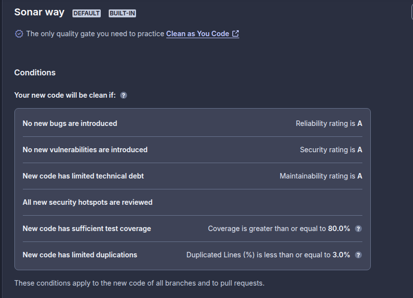
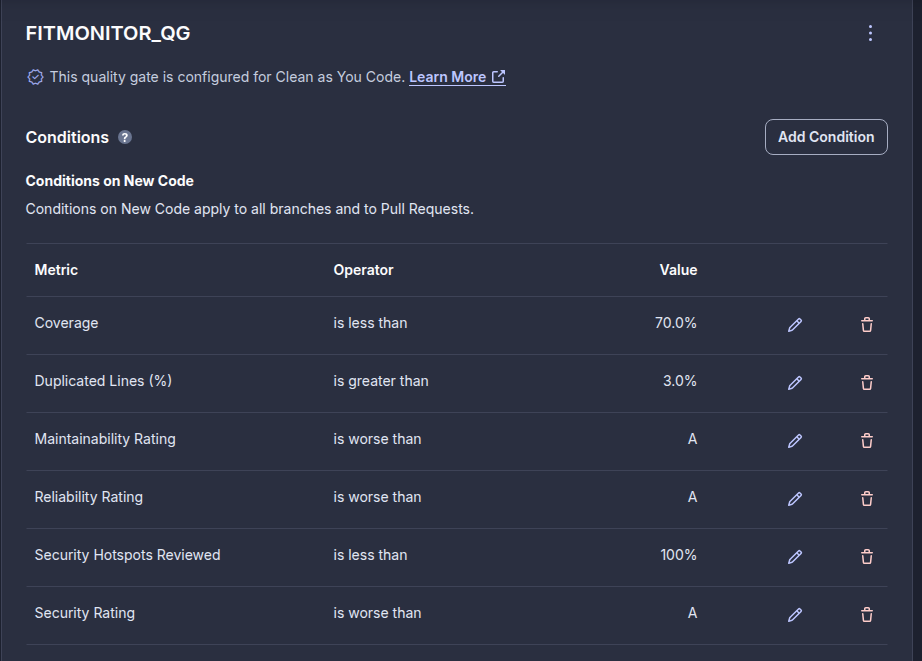
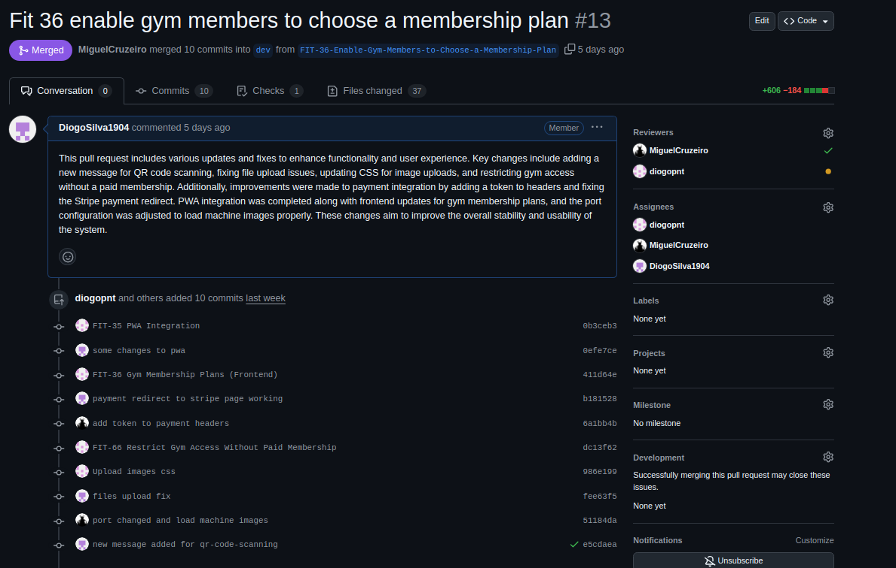
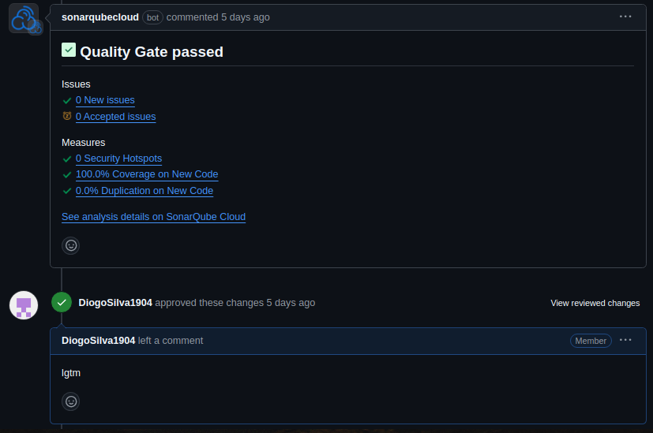

# Continuous Integration

In our development process, continuous integration (CI) helps streamline code integration, testing, and quality analysis. Our CI pipeline automates various tasks to ensure code reliability, efficiency, and maintainability. This page provides an overview of our CI setup and its key components, including automated testing and code analysis, specifically implemented in our build.yml configuration.

With this build.yml file in place on GitHub Actions, the CI pipeline is triggered automatically on every commit or pull request to the dev or main branches.

## Automated tests

Testing is a critical part of our CI process. The build.yml file includes a job that runs unit and integration tests, ensuring that the code works as expected with every change. This step is vital for:

- Preventing Bugs: Running tests for each integration helps catch issues before they reach production.
- Code Reliability: Ensures that new features or fixes do not introduce breaking changes.

## Sonar Cloud Analysis

[SonarCloud](https://sonarcloud.io/organizations/fitmonitor/projects) is integrated into our pipeline to analyze code quality and provide detailed insights into potential issues, technical debt, and code vulnerabilities. This analysis ensures that our codebase remains maintainable, secure, and aligned with coding standards.

In SonarCloud, in addition to the default Sonar Quality Gate, we created a customized Quality Gate tailored to better address the specific needs of certain repositories.

## Pull Request

As outlined in the Definition of Done, any completed task must undergo a peer review before being merged into the dev branch. To facilitate this process, we utilized pull requests, ensuring that the code met quality standards, passed all required tests, and was functioning as intended. This practice not only promoted collaboration and accountability but also helped identify potential issues early, improving overall code quality and maintaining the stability of the development branch.

