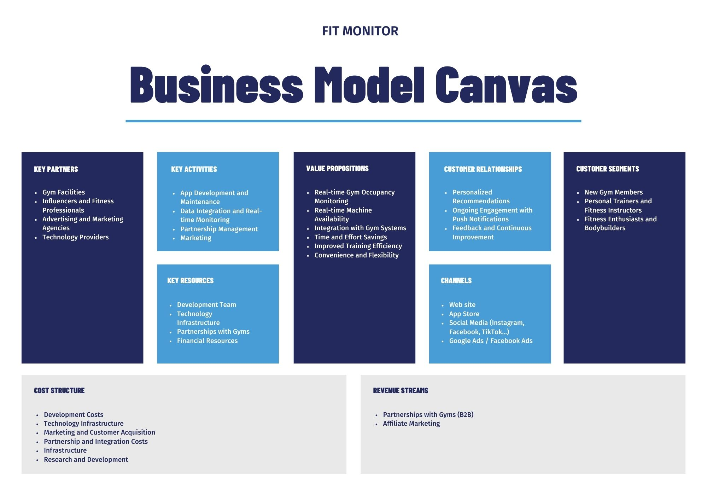

# Business Model Canvas
The Business Model Canvas is a strategic management tool that provides a visual framework for developing, describing, and analyzing a business model. It consists of nine key building blocks that outline the fundamental aspects of a business, including:

1. __Customer Segments__: Defines the different groups of people or organizations a business aims to serve.
2. __Value Propositions__: Describes the unique value that a business offers to its customers, addressing their needs and problems.
3. __Channels__: Outlines how the company delivers its value propositions to customers, including communication and distribution channels.
4. __Customer Relationships__: Details the types of relationships a business establishes with its customer segments to retain them.
5. __Revenue Streams__: Identifies how the company generates income from its value propositions, including pricing mechanisms and revenue sources.
6. __Key Resources__: Lists the critical assets and resources required to deliver the value proposition, serve customer segments, and maintain relationships.
7. __Key Activities__: Describes the essential activities and processes a business must undertake to operate successfully and deliver its value proposition.
8. __Key Partnerships__: Identifies the external organizations and suppliers that help the business achieve its objectives and create value.
9. __Cost Structure__: Outlines the major costs involved in operating the business and delivering its value propositions.

