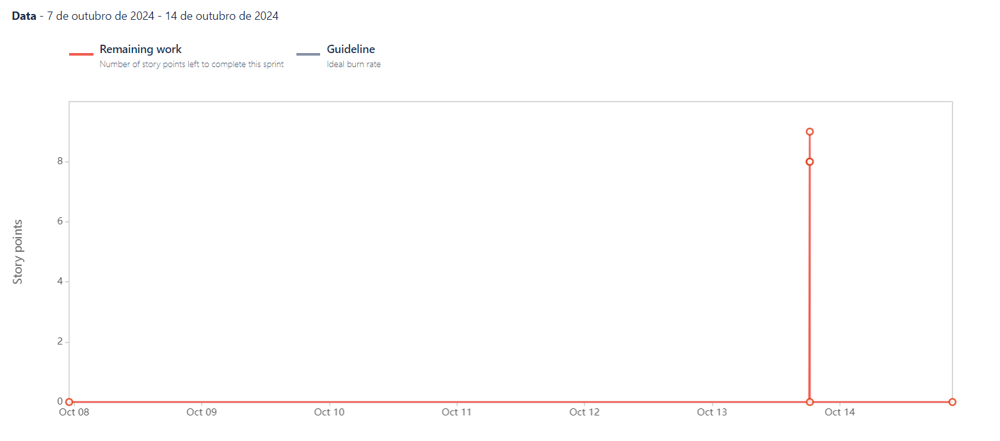

To organize the tasks and ensure alignment, sprints were created, along with weekly (Sunday) meetings with the group to decide together what needed to be done and how the tasks would be distributed among the team members. Sprint reviews with the Software Engineering professors take place biweekly on Mondays, where the sprint's progress and outcomes are reviewed.

For each sprint review, the following elements are addressed:

- __Sprint Goal__: The objective of the sprint.
- __Responsible Team__: Including the Product Owner, Scrum Master, and Developers.
- __User Stories__: The specific user stories being developed.
- __Sprint Retrospective__: A review of what went well, what could be improved, and how to enhance efficiency in the next sprint.
- __Sprint Burndown Chart__: A graphical representation of the remaining work versus time. It helps track the team's progress and predict whether the sprint goal will be achieved within the allotted time.

## Sprint 1 - 07/10/2024 - 13/10/2024
**Sprint Goal**

For the first sprint, the primary focus was to establish the foundational elements required for the project following the change in theme. This included:

1. __Business Model Canvas__: As the project theme was changed, it was necessary to create a new Business Model Canvas to align the business strategy with the development plan.

2. __Definition of Ready and Done__: Establishing clear definitions for "Ready" and "Done" to ensure all user stories meet specific criteria before entering and exiting the sprint workflow.

3. __Story Point Table__: Creating a points table to assign values to user stories, enabling better estimation and tracking of workload.

4. __Initial Website Prototype__: Developing a very basic homepage for the website, serving as a prototype for future design and functionality improvements.

5. __AWS Cognito Integration__: Implementing AWS Cognito for user authentication and login functionalities, laying the groundwork for secure access to the platform.

**Responsible Team**

- Scrum Master: [Miguel Cruzeiro](https://github.com/MiguelCruzeiro)
- Product Owner: [Miguel Vieira](https://github.com/Arn46)
- Developers: [Diogo Pinto](https://github.com/diogopnt) & [Diogo Silva](https://github.com/DiogoSilva1904)

**User Stories**

| User Stories | Description                | Storie Points       |
|--------------|----------------------------|--------------------|
| FIT-3            | LogIn with Email           | 8     |
| FIT-9            | Register with Email  | 5         |

**Sprint Retrospective**

Despite the short duration of this first sprint, we did not anticipate delivering a large number of features. However, we successfully completed all the tasks we had planned, including all user stories related to the user authentication epic: Log In with Email and Register with Email.

**Sprint Burndown Chart**

---

## Sprint 2 - 14/10/2024 - 27/10/2024
**Sprint Goal**

For the second sprint, the focus was on developing essential features that enhance user interaction and management within the gym platform. These features aim to improve both the administrative functionality and the user experience. The main tasks included:

1. __Machine Management__: Implementing a feature that allows gym administrators to add and manage machines available in the gym. This ensures users have updated information on the machines accessible to them.

2. __Homepage Redirection__: Creating a functionality to redirect users to their personalized homepage upon login, where they can quickly access relevant information about their gym, enhancing the user experience by simplifying navigation.

3. __User Access Control__: Adding a user management system, enabling administrators to control access permissions for various users. This ensures that only registered users have the appropriate access rights to the platform's features.

4. __Real-Time Gym Capacity Check__: Developing a section where gym members can view the gym's current capacity. This provides users with the convenience of planning their gym visits based on occupancy, ensuring a better experience.

These implementations lay the groundwork for a more interactive and user-centric platform, allowing both administrators and members to efficiently manage and utilize gym resources.

**Responsible Team**

- Scrum Master: [Diogo Silva](https://github.com/DiogoSilva1904)
- Product Owner: [Diogo Pinto](https://github.com/diogopnt)
- Developers: [Miguel Cruzeiro](https://github.com/MiguelCruzeiro) & [Miguel Vieira](https://github.com/Arn46)

**User Stories**

| User Stories | Description            | Story Points |
|--------------|------------------------|--------------|
| FIT-25       | Add Machines           | 3            |
| FIT-12       | Home-Page Redirect     | 5            |
| FIT-20       | Add User Management    | 8            |
| FIT-26       | See Gym Capacity       | 5            |

**Sprint Retrospective**

In this second sprint, we made significant progress in developing key functionalities focused on user management and interaction within the platform. We successfully completed the Add Machines and Home-Page Redirect user stories, which were implemented and tested thoroughly.

However, the Add User Management and See Gym Capacity functionalities were only partially completed. For Add User Management, some components were implemented, but the story was not fully finalized. For See Gym Capacity, the implementation remains incomplete, as essential testing and the connection between the backend and frontend were not fully achieved.

These pending tasks will be prioritized in the next sprint to ensure the functionalities are fully tested and integrated.

**Sprint Burndown Chart**