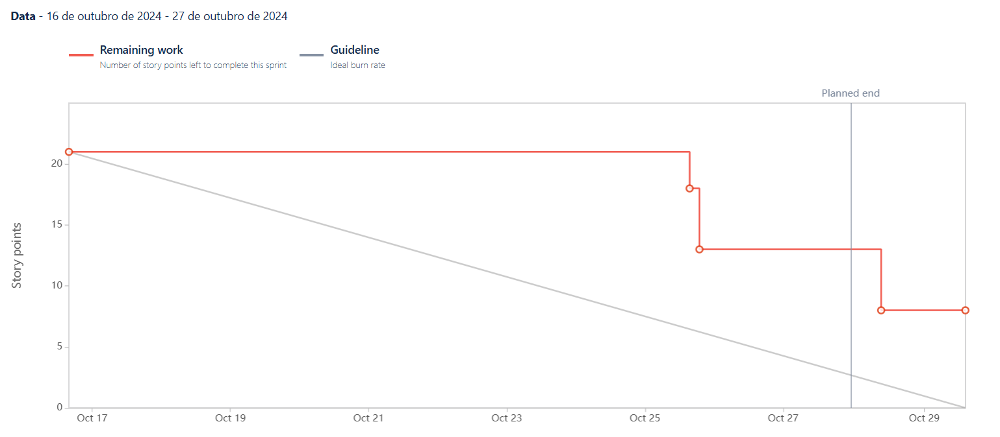
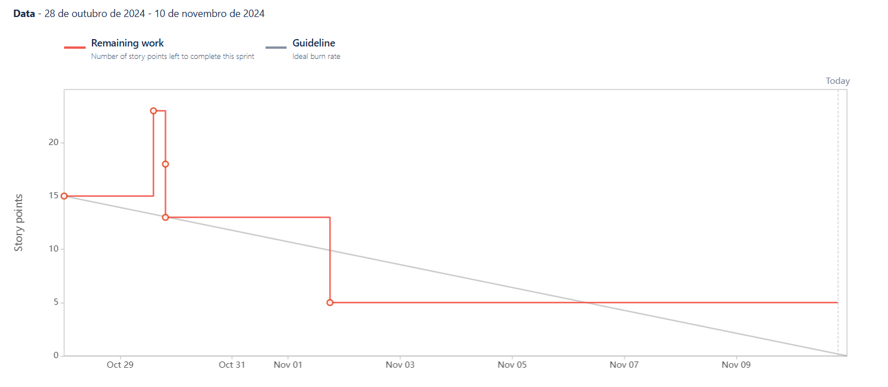
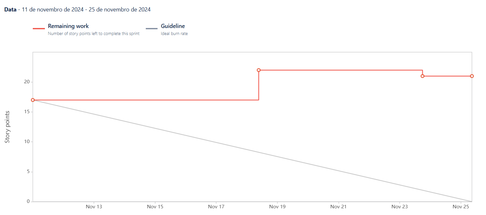
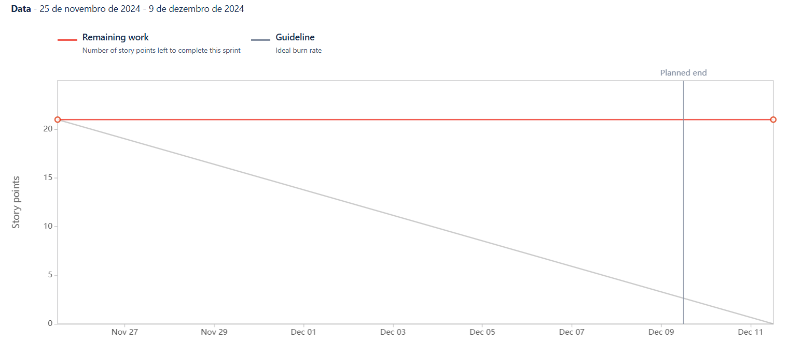
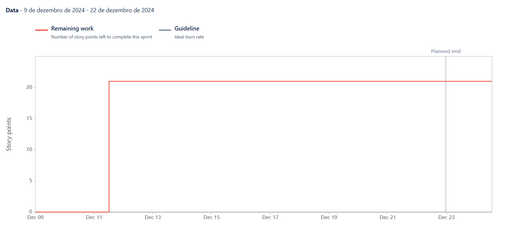
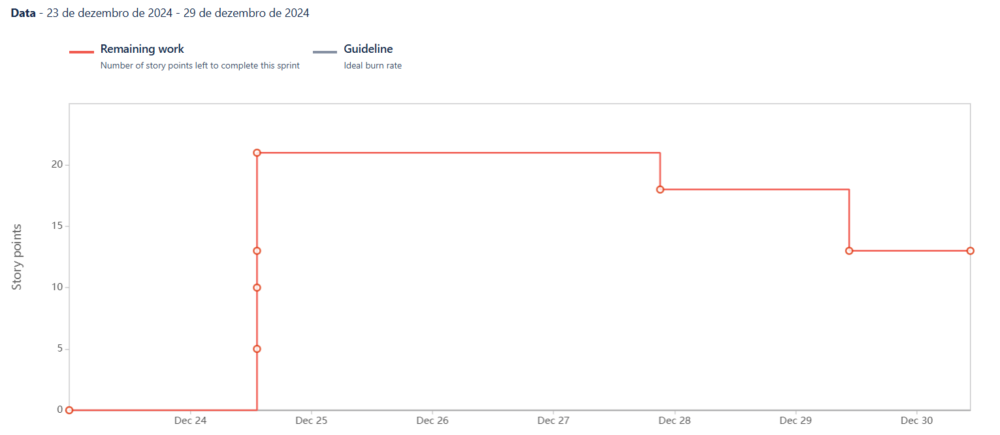

To organize the tasks and ensure alignment, sprints were created, along with weekly (Sunday) meetings with the group to decide together what needed to be done and how the tasks would be distributed among the team members. Sprint reviews with the Software Engineering professors take place biweekly on Mondays, where the sprint's progress and outcomes are reviewed.

For each sprint review, the following elements are addressed:

- __Sprint Goal__: The objective of the sprint.
- __Responsible Team__: Including the Product Owner, Scrum Master, and Developers.
- __User Stories__: The specific user stories being developed.
- __Sprint Retrospective__: A review of what went well, what could be improved, and how to enhance efficiency in the next sprint.
- __Sprint Burndown Chart__: A graphical representation of the remaining work versus time. It helps track the team's progress and predict whether the sprint goal will be achieved within the allotted time.

## Sprint 1 - 07/10/2024 - 13/10/2024
**Sprint Goal**

For the first sprint, the primary focus was to establish the foundational elements required for the project following the change in theme. This included:

1. __Business Model Canvas__: As the project theme was changed, it was necessary to create a new Business Model Canvas to align the business strategy with the development plan.

2. __Definition of Ready and Done__: Establishing clear definitions for "Ready" and "Done" to ensure all user stories meet specific criteria before entering and exiting the sprint workflow.

3. __Story Point Table__: Creating a points table to assign values to user stories, enabling better estimation and tracking of workload.

4. __Initial Website Prototype__: Developing a very basic homepage for the website, serving as a prototype for future design and functionality improvements.

5. __AWS Cognito Integration__: Implementing AWS Cognito for user authentication and login functionalities, laying the groundwork for secure access to the platform.

**Responsible Team**

- Scrum Master: [Miguel Cruzeiro](https://github.com/MiguelCruzeiro)
- Product Owner: [Miguel Vieira](https://github.com/Arn46)
- Developers: [Diogo Pinto](https://github.com/diogopnt) & [Diogo Silva](https://github.com/DiogoSilva1904)

**User Stories**

| User Stories | Description                | Storie Points       |
|--------------|----------------------------|--------------------|
| FIT-3            | [LogIn with Email](https://fitmonitor.atlassian.net/browse/FIT-3)             | 8     |
| FIT-9            | [Register with Email](https://fitmonitor.atlassian.net/browse/FIT-9)    | 5         |

**Sprint Retrospective**

Despite the short duration of this first sprint, we did not anticipate delivering a large number of features. However, we successfully completed all the tasks we had planned, including all user stories related to the user authentication epic: Log In with Email and Register with Email.

**Sprint Burndown Chart**

---

## Sprint 2 - 14/10/2024 - 27/10/2024
**Sprint Goal**

For the second sprint, the focus was on developing essential features that enhance user interaction and management within the gym platform. These features aim to improve both the administrative functionality and the user experience. The main tasks included:

1. __Machine Management__: Implementing a feature that allows gym administrators to add and manage machines available in the gym. This ensures users have updated information on the machines accessible to them.

2. __Homepage Redirection__: Creating a functionality to redirect users to their personalized homepage upon login, where they can quickly access relevant information about their gym, enhancing the user experience by simplifying navigation.

3. __User Access Control__: Adding a user management system, enabling administrators to control access permissions for various users. This ensures that only registered users have the appropriate access rights to the platform's features.

4. __Real-Time Gym Capacity Check__: Developing a section where gym members can view the gym's current capacity. This provides users with the convenience of planning their gym visits based on occupancy, ensuring a better experience.

These implementations lay the groundwork for a more interactive and user-centric platform, allowing both administrators and members to efficiently manage and utilize gym resources.

**Responsible Team**

- Scrum Master: [Diogo Silva](https://github.com/DiogoSilva1904)
- Product Owner: [Diogo Pinto](https://github.com/diogopnt)
- Developers: [Miguel Cruzeiro](https://github.com/MiguelCruzeiro) & [Miguel Vieira](https://github.com/Arn46)

**User Stories**

| User Stories | Description            | Story Points |
|--------------|------------------------|--------------|
| FIT-25       | [Add Machines](https://fitmonitor.atlassian.net/browse/FIT-25)             | 3            |
| FIT-12       | [Home-Page Redirect](https://fitmonitor.atlassian.net/browse/FIT-12)       | 5            |
| FIT-20       | [Add User Management](https://fitmonitor.atlassian.net/browse/FIT-20)      | 8            |
| FIT-26       | [See Gym Capacity](https://fitmonitor.atlassian.net/browse/FIT-26)         | 5            |

**Sprint Retrospective**

In this second sprint, we made significant progress in developing key functionalities, primarily focusing on user management and interaction within the platform. We successfully completed the Add Machines and Home-Page Redirect user stories, both of which were implemented and thoroughly tested.

However, some functionalities, such as Add User Management and See Gym Capacity, remain partially completed. In the Add User Management story, several components were implemented, but the story was not fully finalized. For See Gym Capacity, the implementation was also left incomplete, as essential testing and the connection between the backend and frontend were not fully achieved.

An additional factor contributing to these unfinished tasks has been communication challenges within the development team over the course of these first two sprints. Due to these issues, some development efforts were misdirected to tasks not originally planned for this sprint, impacting the team’s ability to complete the intended work.

To address these challenges and streamline development, we plan to improve organization and clarity within our Jira board. Specifically, we aim to make the details of each user story and task as explicit as possible to ensure all team members have a clear understanding of the scope and priorities.

In the next sprint, we will prioritize the pending tasks to ensure they are fully tested, integrated, and aligned with the planned objectives.

**Sprint Burndown Chart**

---

## Sprint 3 - 28/10/2024 - 10/11/2024
**Sprint Goal**

In this sprint, our objective is to improve the overall user experience by conducting research and developing strategies for essential functionalities related to workout management and user access control. Our primary focus will be on:

1. __Researching QR Code Features__: This includes investigating the best practices and technologies for QR code scanning and generation, as well as how to handle error scenarios effectively, to ensure a seamless user experience when accessing the gym.

2. __Adding New Exercises__: We will enable users to add exercises to their workout plans, allowing them to track their training routines more effectively. This will involve creating an interface where users can input exercise details such as name, repetitions, sets, and weight.

3. __Completing User Management Functionality__: Addressing the task from the previous sprint, we will implement user management features that allow administrators to manage user permissions effectively. This is a "carryover" task aimed at ensuring that only authorized users have access to the gym account.

4. __Deploying in AWS Services__: We will research and set up the necessary infrastructure for deploying our application using AWS services, ensuring scalability and reliability for our user base.

Successfully executing these tasks will enable us to establish a robust foundation for advanced features, enhance user interaction, and ensure secure access for all members while preparing the application for deployment in the cloud.

**Responsible Team**

- Scrum Master: [Miguel Vieira](https://github.com/Arn46)
- Product Owner: [Diogo Silva](https://github.com/DiogoSilva1904)
- Developers: [Miguel Cruzeiro](https://github.com/MiguelCruzeiro) & [Diogo Pinto](https://github.com/diogopnt)

**User Stories**

| User Stories | Description            | Story Points |
|--------------|------------------------|--------------|
| FIT-20       | [Add User Management](https://fitmonitor.atlassian.net/browse/FIT-20)            | 8            |
| FIT-24       | [Add new Exercices](https://fitmonitor.atlassian.net/browse/FIT-24)      | 5            |

**Principal Tasks**

| Tasks | Description            | Type |
|--------------|------------------------|--------------|
| FIT-46       | [Deploy in AWS Services](https://fitmonitor.atlassian.net/browse/FIT-46)            | Cloud            |
| FIT-47       | [QR Code Implementation Research](https://fitmonitor.atlassian.net/browse/FIT-47)      | Research            |

**Sprint Retrospective**

In this third sprint, we made steady progress in several areas, with a focus on user management and exercise functionalities 
within the platform. The __“Add User Management”__ user story, which had been carried over from the previous sprint, was successfully
completed. Additionally, we made progress on the __“Add New Exercises”__ story, implementing the main functionality required to add 
exercises to the system. However, this story remains incomplete according to our __Definition of Done__, as the required testing has 
not yet been performed.

We also conducted two research tasks: deployment on AWS services and QR Code implementation. The QR Code research was fully completed,
providing the foundational knowledge needed for future integration. For __AWS deployment__, we established an initial architecture, 
but there are still some open questions that require clarification from our professors before we can finalize the design to better 
fit our requirements.

Although we did not achieve 100% of what we had initially planned, this sprint marked improvements in team communication and 
organization. Task delegation was clearer, and progress was monitored more effectively, allowing us to address blockers earlier.
Looking ahead, the team has outlined the necessary work for the next sprint, setting clear priorities and defining the research areas 
that need further exploration. With these steps, we are aiming to increase focus and ensure successful completion of ongoing and 
upcoming tasks.

**Sprint Burndown Chart**

---

## Sprint 4 - 11/11/2024 - 24/11/2024
**Sprint Goal**

In this sprint, our goal is to enhance gym member access, app functionality, and reliability by implementing secure QR code features and deploying the app in a robust cloud environment. The main focus will be:

1. __Member Access QR Code Generation__: Upon registration, each gym member will receive a unique QR code, accessible directly in the app, to facilitate entry into the gym. This will improve access control and simplify member check-in.

2. __Gym Entrance QR Code Scanning__: Members will be able to scan their unique QR code at the gym entrance, allowing for a seamless and secure check-in experience. If the code fails to scan, the system will prompt the member to retry, ensuring smooth entry for all users.

3. __AWS Deployment__: Deploying the application on AWS will allow for consistent performance and high availability, ensuring members have reliable access to their data and a seamless experience across all features.

4. __Log-Out Feature__: Adding a log-out option will provide members with the ability to switch accounts securely within the app.

Completing these objectives will enhance entry processes, improve security, and provide members with a reliable, high-performance application that supports their needs efficiently.

**Responsible Team**

- Scrum Master: [Diogo Pinto](https://github.com/diogopnt)
- Product Owner: [Miguel Cruzeiro](https://github.com/MiguelCruzeiro)
- Developers: [Miguel Vieira](https://github.com/Arn46) & [Diogo Silva](https://github.com/DiogoSilva1904)

**User Stories**

| User Stories | Description                              | Story Points |
|--------------|------------------------------------------|--------------|
| FIT-24       | [Add new Exercices](https://fitmonitor.atlassian.net/browse/FIT-24)                         | 5            |
| FIT-42       | [QR Code Scanning at Gym Entrance](https://fitmonitor.atlassian.net/browse/FIT-42)          | 5            |
| FIT-21       | [QR Code Generation for Members](https://fitmonitor.atlassian.net/browse/FIT-21)           | 3            |
| FIT-59       | [AWS Deployment](https://fitmonitor.atlassian.net/browse/FIT-59)                           | 8            |
| FIT-58       | [Log Out](https://fitmonitor.atlassian.net/browse/FIT-58?atlOrigin=eyJpIjoiNDRjNWM3NDVlYjU2NDc4ODk3MDc4ZWJhYWQ1YmZjMzYiLCJwIjoiaiJ9)                                  | 1            |

**Principal Tasks**

| Tasks | Description            | Type |
|--------------|------------------------|--------------|
| FIT-46       | [Deploy in AWS Services](https://fitmonitor.atlassian.net/browse/FIT-46)           | Cloud            |

**Sprint Retrospective**

In this sprint, the progress achieved was limited due to competing priorities from assignments and deliverables in other courses. 
As a result, only the __“Log Out”__ user story was fully completed and met the team’s __Definition of Done__. 
This feature now allows users to securely log out and switch accounts seamlessly.

The __“AWS Deployment”__ task also saw some advancement, with foundational work on deploying the application in the cloud. 
However, this task remains incomplete according to the __Definition of Done__, as further refinement and clarification are required to 
align the architecture with project requirements.

Unfortunately, the remaining user stories — __“Add New Exercises”__ __“QR Code Scanning at Gym Entrance”__ and 
__“QR Code Generation for Members”__ — were not addressed in this sprint. These will carry over to the next sprint for prioritization.

Despite the reduced output during this sprint, the team remains committed to addressing these outstanding tasks and has already 
planned the work for the upcoming sprint. Additionally, the planned Sprint Review session with professors has been rescheduled to 
December 9th, giving the team additional time to deliver more comprehensive results for feedback.

Moving forward, the focus will be on balancing academic commitments and project tasks to ensure steady progress while 
adhering to project deadlines.

**Sprint Burndown Chart**

---

## Sprint 5 - 25/11/2024 - 08/12/2024
**Sprint Goal**

In this sprint, our primary objective is to complete the work carried over from the previous sprint, focusing on enhancing gym member access, app functionality, and cloud reliability. The main priorities will be:

1. __Member Access QR Code Generation__: Finalizing the feature that provides each gym member with a unique QR code upon registration. This QR code will be accessible within the app and streamline access control by simplifying member check-ins.

2. __Gym Entrance QR Code Scanning__: Implementing and testing the functionality that allows members to scan their unique QR code at the gym entrance for a seamless and secure check-in process. Ensuring the system handles errors effectively if a scan fails.

3. __AWS Deployment__: Completing the deployment of the application on AWS, establishing a robust cloud environment for consistent performance and high availability. This will ensure a reliable and scalable user experience across all app features.

By focusing on these critical areas, the team aims to finalize the foundational features for member access and secure the application’s infrastructure to enhance reliability, usability, and overall performance.

**Responsible Team**

- Scrum Master: [Diogo Pinto](https://github.com/diogopnt)
- Product Owner: [Miguel Cruzeiro](https://github.com/MiguelCruzeiro)
- Developers: [Miguel Vieira](https://github.com/Arn46) & [Diogo Silva](https://github.com/DiogoSilva1904)

**User Stories**

| User Stories | Description                              | Story Points |
|--------------|------------------------------------------|--------------|
| FIT-24       | [Add new Exercices](https://fitmonitor.atlassian.net/browse/FIT-24)                        | 5            |
| FIT-42       | [QR Code Scanning at Gym Entrance](https://fitmonitor.atlassian.net/browse/FIT-42)         | 5            |
| FIT-21       | [QR Code Generation for Members](https://fitmonitor.atlassian.net/browse/FIT-21)           | 3            |
| FIT-59       | [AWS Deployment](https://fitmonitor.atlassian.net/browse/FIT-59)                           | 8            |

**Principal Tasks**

| Tasks | Description            | Type |
|--------------|------------------------|--------------|
| FIT-46       | [Deploy in AWS Services](https://fitmonitor.atlassian.net/browse/FIT-46)          | Cloud   

**Sprint Retrospective**

In this sprint, we were unable to implement any of the planned features due to the significant workload from other academic disciplines and the Intermediate 
Assessment Period (IAP) for Software Engineering. As a result, all the user stories and tasks scheduled for this sprint will be carried over to the next sprint. 
The team’s primary goal moving forward is to finalize these items and begin tackling the subsequent planned features.

The carried-over work includes:

1. __FIT-24__: [Add new Exercices](https://fitmonitor.atlassian.net/browse/FIT-24)  
2. __FIT-42__: [QR Code Scanning at Gym Entrance](https://fitmonitor.atlassian.net/browse/FIT-42)  
3. __FIT-21__: [QR Code Generation for Members](https://fitmonitor.atlassian.net/browse/FIT-21) 
4. __FIT-59__: [AWS Deployment](https://fitmonitor.atlassian.net/browse/FIT-59) 
5. __FIT-46__: [Deploy in AWS Services](https://fitmonitor.atlassian.net/browse/FIT-46) 

This sprint also presented a significant challenge as one of the team members left the project. 
Consequently, we had to reassess and adjust the final project scope. Some planned functionalities will not be developed to accommodate the reduced team capacity.

It’s worth noting that progress on the project has been minimal over the past three weeks due to these challenges. 
However, the team is committed to reversing this trend. In the upcoming weeks, we aim to accelerate development and regain momentum to ensure
 steady progress toward completing the project.

Despite the setbacks, we remain focused on delivering the most essential features and achieving the project’s key objectives.

**Sprint Burndown Chart**

---

## Sprint 6 - 08/12/2024 - 22/12/2024
**Sprint Goal** 

In this sprint, our primary objective is to complete the work carried over from Sprint 5. This includes finalizing the implementation of key features for gym member access, such as QR code functionalities, and completing the AWS deployment to ensure a reliable and scalable application infrastructure.

By focusing on these pending tasks, we aim to meet the goals originally set for the previous sprint and establish a solid foundation for future development.

**Responsible Team**

- Scrum Master: [Diogo Silva](https://github.com/DiogoSilva1904)
- Product Owner: [Diogo Pinto](https://github.com/diogopnt)
- Developers: [Miguel Cruzeiro](https://github.com/MiguelCruzeiro)

**User Stories**

| User Stories | Description                              | Story Points |
|--------------|------------------------------------------|--------------|
| FIT-24       | [Add new Exercices](https://fitmonitor.atlassian.net/browse/FIT-24)                        | 5            |
| FIT-42       | [QR Code Scanning at Gym Entrance](https://fitmonitor.atlassian.net/browse/FIT-42)         | 5            |
| FIT-21       | [QR Code Generation for Members](https://fitmonitor.atlassian.net/browse/FIT-21)           | 3            |
| FIT-59       | [AWS Deployment](https://fitmonitor.atlassian.net/browse/FIT-59)                           | 8            |

**Principal Tasks**

| Tasks | Description            | Type |
|--------------|------------------------|--------------|
| FIT-46       | [Deploy in AWS Services](https://fitmonitor.atlassian.net/browse/FIT-46)          | Cloud   

**Sprint Retrospective**

In this sprint, we faced significant challenges in progressing with the planned work due to the end of classes and the 
heavy workload from other project submissions. As a result, none of the planned user stories or tasks were completed. 

Despite this, we conducted a sprint review and realigned our approach for the remaining project timeline. 
Considering that the final delivery is due on January 9th, we have decided to make significant adjustments to our workflow:

1. __Focus on Outstanding Work__: Moving forward, our priority will be to complete all the pending user stories and tasks 
from the previous sprints. The team will fully dedicate efforts to ensure that these features and functionalities 
are delivered on time and meet the project’s requirements.

2. __Shorter Sprints__: To better manage the workload and maintain tighter control over deliverables, we will shift from 
two-week sprints to one-week sprints. This change will allow us to monitor progress more closely and adapt quickly 
to any challenges that arise.

While this sprint did not yield tangible progress in terms of deliverables, we are committed to turning the situation 
around in the upcoming sprints. The team has realigned its focus, and with the adjusted sprint structure, we are confident 
in our ability to meet the project goals and deadlines effectively.

**Sprint Burndown Chart**

---

## Sprint 7 - 23/12/2024 - 29/12/2024
**Sprint Goal** 

In this sprint, our primary objective is to complete the work carried over from Sprint 6. This includes finalizing the implementation of key features for gym member access, such as QR code functionalities, and completing the AWS deployment to ensure a reliable and scalable application infrastructure.

By focusing on these pending tasks, we aim to meet the goals originally set for the previous sprint and establish a solid foundation for future development.

**Responsible Team**

- Scrum Master: [Miguel Cruzeiro](https://github.com/MiguelCruzeiro)
- Product Owner: [Diogo Silva](https://github.com/DiogoSilva1904)
- Developers: [Diogo Pinto](https://github.com/diogopnt)

**User Stories**

| User Stories | Description                              | Story Points |
|--------------|------------------------------------------|--------------|
| FIT-24       | [Add new Exercices](https://fitmonitor.atlassian.net/browse/FIT-24)                        | 5            |
| FIT-42       | [QR Code Scanning at Gym Entrance](https://fitmonitor.atlassian.net/browse/FIT-42)         | 5            |
| FIT-21       | [QR Code Generation for Members](https://fitmonitor.atlassian.net/browse/FIT-21)           | 3            |
| FIT-59       | [AWS Deployment](https://fitmonitor.atlassian.net/browse/FIT-59)                           | 8            |

**Principal Tasks**

| Tasks | Description            | Type |
|--------------|------------------------|--------------|
| FIT-46       | [Deploy in AWS Services](https://fitmonitor.atlassian.net/browse/FIT-46)          | Cloud   

**Sprint Retrospective**

In Sprint 7, we made significant progress by completing most of the planned user stories, but some adjustments had to be made to the project scope due to unforeseen circumstances. Below is an overview of our accomplishments and challenges:

__Completed User Stories__

[FIT-42: QR Code Scanning at Gym Entrance](https://fitmonitor.atlassian.net/browse/FIT-42): This functionality was successfully implemented and met our __Definition of Done (DoD)__. Gym members can now use the QR code scanning feature for seamless entry.

[FIT-21: QR Code Generation for Members](https://fitmonitor.atlassian.net/browse/FIT-21): The system now generates unique QR codes for each member upon registration, providing an improved and secure gym access experience.

__AWS Deployment Preparations__

Although [FIT-59: AWS Deployment](https://fitmonitor.atlassian.net/browse/FIT-59) has not been completed, we successfully finalized the associated task [FIT-46: Deploy in AWS Services](https://fitmonitor.atlassian.net/browse/FIT-46). The architecture for cloud deployment is now fully designed, and the necessary AWS services have been identified. The actual deployment will be carried out in the final week once the MVP is fully developed.

__Challenges and Adjustments__

[FIT-24: Add New Exercises](https://fitmonitor.atlassian.net/browse/FIT-24) was not implemented. This feature was originally assigned to a team member who left the project. After evaluating its relevance to the MVP, the team decided it will no longer be part of the development scope.

[FIT-59: AWS Deployment](https://fitmonitor.atlassian.net/browse/FIT-59) will be deferred to the final sprint. This decision was made to prioritize completing and refining the MVP before focusing on deployment.

**Sprint Burndown Chart**

---

## Sprint 8 - 30/12/2024 - 05/01/2025
**Sprint Goal** 

In this sprint, our primary objective is to finalize all functionalities related to QR codes, ensuring seamless integration and usability across the gym platform. This includes completing tasks such as QR code generation for gym machines, scanning for machine check-ins, and viewing machine occupancy in real time.

After completing all tasks related to QR codes, we will advance to the user stories focused on payment functionalities, laying the groundwork for secure and efficient membership payment processing.

By the end of the sprint, we aim to have the MVP (Minimum Viable Product) fully ready, covering all core features required for a functional and efficient gym management system. This will set the stage for the final sprint, where the focus will be exclusively on deployment in AWS Services.

With this plan, the team is committed to delivering a product that meets the project requirements and prepares us for the final steps of the development process.

**Responsible Team**

- Scrum Master: [Diogo Pinto](https://github.com/diogopnt)
- Product Owner: [Miguel Cruzeiro](https://github.com/MiguelCruzeiro)
- Developers: [Diogo Silva](https://github.com/DiogoSilva1904)

**User Stories**  

| User Stories | Description                                                         | Story Points |
|--------------|---------------------------------------------------------------------|--------------|
| FIT-61       | [QR Code Generation for Gym Machines](https://fitmonitor.atlassian.net/browse/FIT-61)            | 5            |
| FIT-62       | [Upload Images for Gym Machines](https://fitmonitor.atlassian.net/browse/FIT-62)                 |3            |
| FIT-51       | [View Occupied Machine Status in Real-Time](https://fitmonitor.atlassian.net/browse/FIT-51)      | 8            |
| FIT-34       | [QR Code Scanning for Machine Check-In](https://fitmonitor.atlassian.net/browse/FIT-34)          | 5            |
| FIT-36       | [Enable Gym Members to Add Payment Methods](https://fitmonitor.atlassian.net/browse/FIT-36)      | 3            |
| FIT-64       | [Generate Payment Invoices for Members](https://fitmonitor.atlassian.net/browse/FIT-64)          | 5            |
| FIT-65       | [Process Gym Membership Payments](https://fitmonitor.atlassian.net/browse/FIT-65)                | 8            |
| FIT-66       | [View Payment History and Download Receipts](https://fitmonitor.atlassian.net/browse/FIT-66)     | 3            |

**Principal Tasks**  

| Tasks  | Description                           | Type         |
|--------|---------------------------------------|--------------|
| FIT-35 | [PWA Integration](https://fitmonitor.atlassian.net/browse/FIT-35)  | Integration  |
